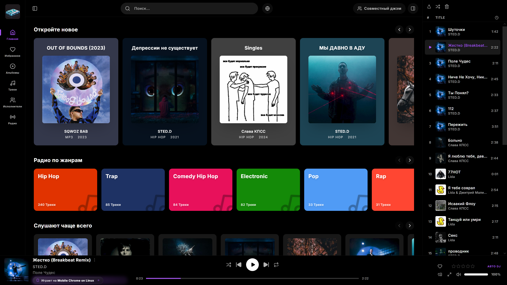
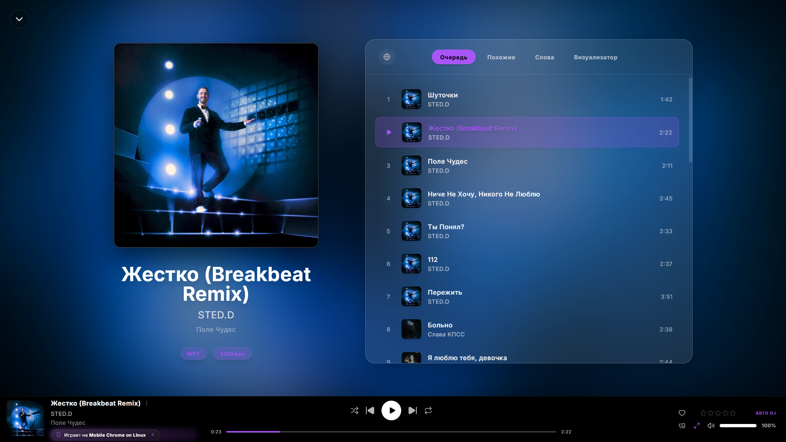

<div align="right">
  <a href="README.md"></a>
  <a href="README_en.md"></a>
</div>

<div align="center">
  
  
  # Holad
  
  **Аудио-опыт нового поколения.** 
  Современная, кастомизируемая стриминговая платформа и плеер. Holad выступает в роли элегантного и быстрого клиента для серверов Subsonic/Navidrome.
  Создавая этот проект, я вдохновлялся **Spotify**, **Feishin** и **Substream**. Огромное спасибо их разработчикам за труд и идеи!

  [](https://github.com/FHRha/Holad/releases)
  [](LICENSE)
</div>

---

## Особенности

- **Интеграция с Subsonic / Navidrome**: Holad безопасно проксирует запросы к вашему серверу, скрывая учетные данные и обеспечивая плавное воспроизведение.
- **Современный UI/UX**: Потрясающий визуальный интерфейс с плавными анимациями, поддержкой светлой/темной темы и настраиваемыми элементами (Drag-and-Drop).
- **HoladConnect**: Мгновенная синхронизация состояния плеера между всеми вашими устройствами. Начните слушать на ПК и продолжите на телефоне без прерываний!
- **Jam Сессии**: Слушайте музыку вместе с друзьями в реальном времени. Создавайте комнаты и управляйте очередью воспроизведения сообща.
- **Мультиязычность**: Встроенная поддержка нескольких языков (в данный момент доступны **Русский** и **Английский**).
- **Self-Hosted**: Полный контроль над вашими данными. Легко разворачивается на собственном Linux или Windows сервере.

## Скриншоты

### Главный экран


### Плеер и визуализация


## Быстрый старт (Продакшен)

Чтобы установить Holad на ваш Linux-сервер одной командой, выполните:

```bash
curl -sSL https://raw.githubusercontent.com/FHRha/Holad/main/install.sh | bash
```

Скрипт поможет вам настроить систему, создаст службу systemd, сконфигурирует Nginx и подготовит окружение.
Для сборки вручную используйте `build_release.sh` (Linux/macOS) или `build_release.bat` (Windows).

## Архитектура

- **Frontend**: React 19, Vite, TailwindCSS, Zustand, Framer Motion, Socket.io-client, dnd-kit.
- **Backend**: Node.js, Express, Socket.io (для HoladConnect и Jam-сессий), TypeScript.

## Лицензия

Проект распространяется под **Holad Non-Commercial License**. 
Вы можете свободно использовать, изучать и модифицировать код для личных, некоммерческих целей. Любое коммерческое использование (продажа, интеграция в платные продукты, монетизация) строго запрещено без разрешения создателя (FHRha). Подробнее см. файл [LICENSE](LICENSE).
