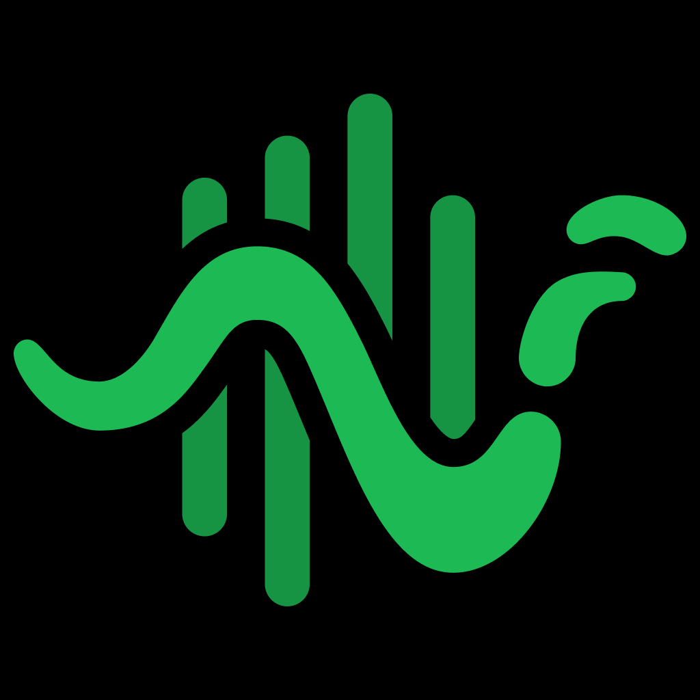
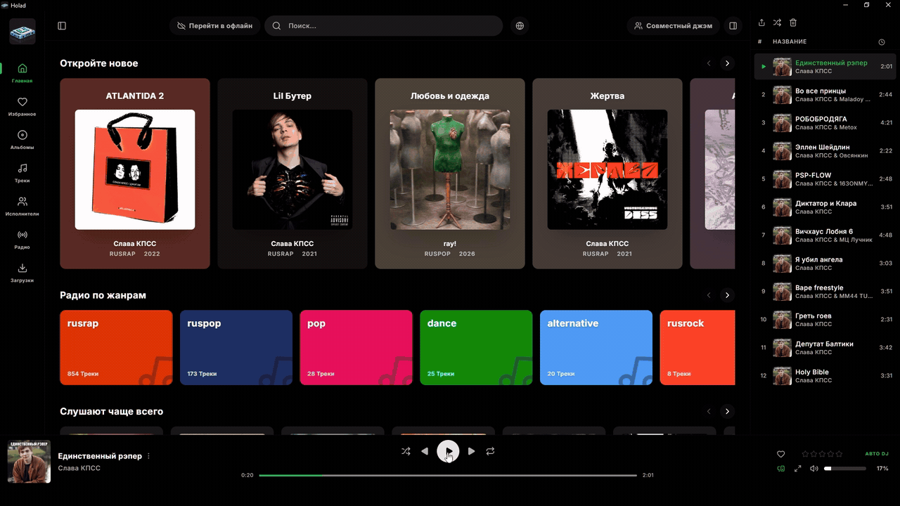

<div align="right">
  <a href="README.md"></a>
  <a href="README_en.md"></a>
</div>

<div align="center">
  <a href="https://holad-demo.onrender.com/" target="_blank" rel="noopener noreferrer" title="Попробовать онлайн демо-версию Holad">
    
  </a>
  <a href="https://holad-demo.onrender.com/" target="_blank" rel="noopener noreferrer" title="Попробовать онлайн демо-версию Holad">
    
  </a>
  <a href="https://holad-demo.onrender.com/" target="_blank" rel="noopener noreferrer" title="Попробовать онлайн демо-версию Holad">
    
  </a>
  
  # Holad
  
  **Аудио-опыт нового поколения.** 
  Современная, кастомизируемая стриминговая платформа и плеер. Holad выступает в роли элегантного и быстрого клиента для серверов Subsonic/Navidrome.
  Создавая этот проект, я вдохновлялся **Spotify**, **Feishin** и **Substreamer**. Огромное спасибо их разработчикам за труд и идеи!

  <br />

  <a href="https://holad-demo.onrender.com/" target="_blank" rel="noopener noreferrer">
    
  </a>

  <p><i>Нажмите на любой логотип выше или на кнопку Live Demo, чтобы открыть интерактивную демонстрацию в браузере без установки.</i></p>

  [](https://github.com/FHRha/Holad/releases)
  [](LICENSE)
  [](https://github.com/FHRha/Holad/releases)

  <br />
  
  <h3>Скачать Holad</h3>

  <a href="https://github.com/FHRha/Holad/releases/latest">
    
  </a>
  <a href="https://github.com/FHRha/Holad/releases/latest">
    
  </a>
  <a href="https://github.com/FHRha/Holad/releases/latest">
    
  </a>
  <a href="https://github.com/FHRha/Holad/releases/latest">
    
  </a>
  <a href="docs/docker.md">
    
  </a>

  <br />
  <p><i>* P.S. Код и заготовки для продукции Apple (macOS и iOS) уже есть, но так как автор бедный студент без продукции Apple, возможности скомпилировать и выложить их пока нет </i></p>
</div>

---

## Особенности

- **Интеграция с Subsonic / Navidrome**: Holad безопасно проксирует запросы к вашему серверу, шифрует учетные данные с помощью AES-256-GCM и обеспечивает мгновенное плавное воспроизведение.
- **Современный UI/UX и Кастомизация**: Элегантный адаптивный интерфейс с поддержкой светлой и темной темы, жестовым управлением (Drag-and-Drop, Pull-to-Dismiss) и возможностью выбора фирменных иконок приложения (Кассета, Wave Dark, Wave Light).
- **Пользовательские Плейлисты и Оффлайн-режим**: Создание собственных плейлистов с динамическими 2x2 мозаичными обложками. Полная поддержка автономной работы: скачивайте треки и альбомы на Desktop и Android и слушайте без доступа к интернету.
- **Продвинутый Звуковой Движок**: Плавный Crossfade между треками, встроенный визуализатор звука, защита от переполнения буфера, множитель громкости и умное скрытие нежелательных треков (Ignore-list).
- **HoladConnect**: Мгновенная синхронизация состояния плеера между всеми вашими устройствами в реальном времени. Начните слушать на ПК и продолжите на телефоне без прерываний!
- **Социальный Хаб и Jam-сессии**: Слушайте музыку вместе с друзьями в реальном времени. Общайтесь в комнатах, делитесь любимыми треками и управляйте общей очередью воспроизведения.
- **Локальная База Данных SQLite с шифрованием**: Синхронизация настроек, истории прослушиваний, плейлистов и исключений между вашими устройствами. Все пароли и токены зашифрованы алгоритмом AES-256-GCM и хранятся локально на вашем сервере (в `holad.sqlite`).
- **Глубокая Интеграция с ОС**: Полноценное управление из системного трея (Windows/Linux) с крупной обложкой трека, поддержка Media Session на Android (управление с экрана блокировки и шторки) и нативная интеграция с панелью задач.
- **Мультиязычность**: Встроенная поддержка нескольких языков (в данный момент доступны **Русский** и **Английский**).
- **Self-Hosted & Демо-режим**: Полный контроль над вашими данными. Легко разворачивается на собственном Linux или Windows сервере, а также поддерживает встроенный безопасный демонстрационный режим ([онлайн демо-версия](https://holad-demo.onrender.com/)) с управляемым пулом гостевых слотов и автоматической очисткой.

## Демонстрация интерфейса



## Быстрый старт

### Развёртывание в Docker

Для Holad доступен официальный multi-arch Docker-образ (`ghcr.io/fhrha/holad:latest`) с поддержкой x86_64 и ARM64 (Raspberry Pi), автообновлениями через Watchtower и онлайн-бэкапами базы данных.

Подробное руководство по настройке, параметры окружения и готовые рецепты (связка с Navidrome, Caddy, Nginx):
- <a href="docs/docker.md"></a> [**Руководство по Docker на русском**](docs/docker.md)
- <a href="docs/docker_en.md"></a> [**Docker Deployment Guide (English)**](docs/docker_en.md)

---

### Установка на хост без Docker (Linux)

Если вы предпочитаете классическую установку напрямую на сервер:

```bash
curl -sSL https://raw.githubusercontent.com/FHRha/Holad/main/install.sh | bash
```

Скрипт интерактивно запросит порт (по умолчанию 4000), базовый путь маршрутизации (`BASE_PATH`, по умолчанию `/` для корня, либо любую подпапку вроде `/Holad`) и создание службы `systemd`. 
Параметры можно передать сразу в одну строку:
```bash
curl -sSL https://raw.githubusercontent.com/FHRha/Holad/main/install.sh | bash -s -- --port 4000 --base-path /Holad
```
*Для ручной сборки используйте `build_release.sh` (Linux/macOS) или `build_release.bat` (Windows).*

### Настройка Nginx

Все компоненты Holad (интерфейс, страница входа, Jam-сессии, сокеты, API и статика) строго инкапсулированы внутри `BASE_PATH`. Сервер автоматически отправляет заголовок `X-Accel-Buffering: no` для аудиопотока, чтобы исключить буферизацию треков в Nginx.

Для надёжной работы WebSockets (Holad Connect) и исключения ошибок вида `Invalid Upgrade header` рекомендуется выносить сокеты в отдельный блок:

#### Если Holad запущен в подпапке (`BASE_PATH=/Holad`):
```nginx
# Сокеты Holad Connect и Jam-сессий
location /Holad/socket.io/ {
    proxy_pass http://127.0.0.1:4000;
    include snippets/proxy-params.conf;
    proxy_set_header Upgrade "websocket";
    proxy_set_header Connection "upgrade";
    proxy_buffering off;
    proxy_read_timeout 86400s;
    proxy_send_timeout 86400s;
}

# Интерфейс и REST API
location /Holad/ {
    proxy_pass http://127.0.0.1:4000;
    include snippets/proxy-params.conf;
}

location = /Holad {
    return 301 /Holad/;
}
```

#### Если Holad запущен на отдельном домене (`BASE_PATH=/`):
```nginx
# Сокеты Holad Connect и Jam-сессий
location /socket.io/ {
    proxy_pass http://127.0.0.1:4000;
    include snippets/proxy-params.conf;
    proxy_set_header Upgrade "websocket";
    proxy_set_header Connection "upgrade";
    proxy_buffering off;
    proxy_read_timeout 86400s;
    proxy_send_timeout 86400s;
}

# Основной веб-интерфейс и REST API
location / {
    proxy_pass http://127.0.0.1:4000;
    include snippets/proxy-params.conf;
}
```

> [!TIP]
> **Эталонный файл `snippets/proxy-params.conf` (или системный `proxy_params`):**
> Убедитесь, что сниппет содержит только стандартные заголовки без `Upgrade`/`Connection`, чтобы избежать их дублирования:
> ```nginx
> proxy_set_header Host $host;
> proxy_set_header X-Real-IP $remote_addr;
> proxy_set_header X-Forwarded-For $proxy_add_x_forwarded_for;
> proxy_set_header X-Forwarded-Proto $scheme;
> proxy_http_version 1.1;
> ```

После внесения изменений выполните `sudo nginx -t && sudo systemctl restart nginx`.

### Решение проблем со входом (NAT Loopback)
Для защиты от SSRF сервер Holad разрешает вход только если URL, который вы вводите в браузере, совпадает с внешним доменом. Однако, если Holad установлен в домашней сети, при попытке проверить этот домен запрос может зависнуть из-за блокировки вашим роутером "разворота" трафика (отсутствие Hairpin NAT).
Чтобы исправить это, подскажите серверу обращаться к локалхосту напрямую:
```bash
echo "127.0.0.1 ВАШ_ДОМЕН" | sudo tee -a /etc/hosts
```

## Архитектура

- **Frontend**: React 19, Vite, TailwindCSS, Zustand, Framer Motion, Socket.io-client, dnd-kit.
- **Backend**: Node.js, Express, Socket.io (для HoladConnect и Jam-сессий), SQLite (better-sqlite3), AES-256-GCM, TypeScript.
- **Desktop**: Tauri v2 (Rust).
- **Mobile**: Capacitor 8 (Android).

## Лицензия

Проект распространяется под **Holad Non-Commercial License**. 
Вы можете свободно использовать, изучать и модифицировать код для личных, некоммерческих целей. Любое коммерческое использование (продажа, интеграция в платные продукты, монетизация) строго запрещено без разрешения создателя (FHRha). Подробнее см. файл [LICENSE](LICENSE).
