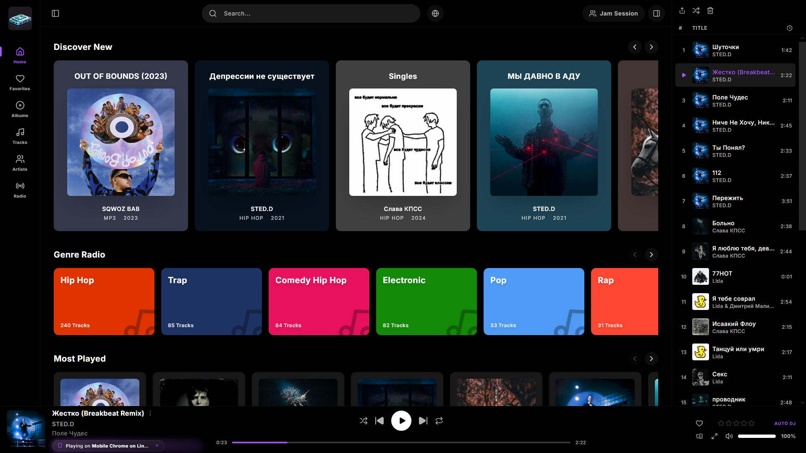
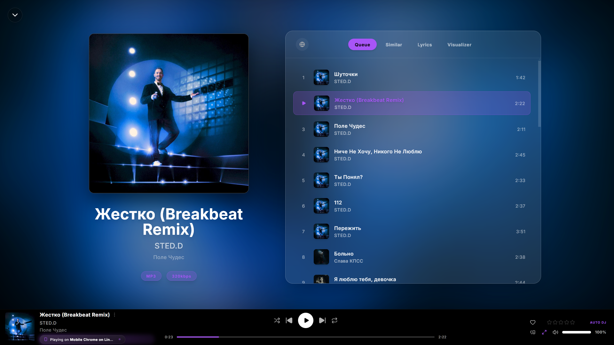

<div align="right">
  <a href="README.md"></a>
  <a href="README_en.md"></a>
</div>

<div align="center">
  
  
  # Holad
  
  **Your Next-Generation Audio Experience.** 
  A modern, highly customizable streaming platform and player. Holad acts as an elegant and lightning-fast client for your Subsonic/Navidrome servers.
  While building this project, I was heavily inspired by **Spotify**, **Feishin**, and **Substream**. A massive thank you to their developers for their hard work and ideas!

  [](https://github.com/FHRha/Holad/releases)
  [](LICENSE)
</div>

---

## Features

- **Subsonic / Navidrome Integration**: Holad securely proxies requests to your server, hiding credentials while providing seamless playback.
- **Modern UI/UX**: A visually stunning interface with smooth animations, light/dark themes, and customizable drag-and-drop elements.
- **HoladConnect**: Instant synchronization of player state across all your devices. Start listening on your PC and continue seamlessly on your phone!
- **Jam Sessions**: Listen to music together with friends in real-time. Create rooms and manage the playback queue collaboratively.
- **Localization**: Built-in multi-language support (currently **Russian** and **English** are available).
- **Self-Hosted**: Full control over your data. Deploy it easily on your own Linux or Windows server.

## Screenshots

### Main Dashboard


### Player & Visualization


## Quick Start (Linux)

To install Holad on your server in one command, run:

```bash
curl -sSL https://raw.githubusercontent.com/FHRha/Holad/main/install.sh | bash
```

The script will download the latest release, install it to `/opt/holad`, fetch dependencies, and create a `systemd` service for background execution on port 4000. 
*For manual builds, use `build_release.sh` (Linux/macOS) or `build_release.bat` (Windows).*

### Nginx Configuration

If you are using **Nginx** as a reverse proxy (recommended), add the following `location` blocks inside your server block (e.g., in `/etc/nginx/sites-available/...`) to proxy requests to the player without conflicts:

```nginx
    # --- Holad Player ---
    
    # 1. Player Interface
    location /Holad {
        proxy_pass http://127.0.0.1:4000/Holad;
        include snippets/proxy-params.conf;
    }

    # 2. Login Page
    location /login {
        proxy_pass http://127.0.0.1:4000/login;
        include snippets/proxy-params.conf;
    }

    # 3. Jam Sessions Interface
    location /jam {
        proxy_pass http://127.0.0.1:4000/jam;
        include snippets/proxy-params.conf;
    }

    # 4. WebSockets for HoladConnect and Jam Sessions
    location /socket.io/ {
        proxy_pass http://127.0.0.1:4000/socket.io/;
        include snippets/proxy-params.conf;
    }
```
*(Note: `include snippets/proxy-params.conf;` includes standard proxy headers. On Ubuntu/Debian, you can use the built-in `include proxy_params;`. If you are using your own `snippets/proxy-params.conf` file, make sure it contains the following:)*
```nginx
proxy_set_header Host $host;
proxy_set_header X-Real-IP $remote_addr;
proxy_set_header X-Forwarded-For $proxy_add_x_forwarded_for;
proxy_set_header X-Forwarded-Proto $scheme;
proxy_http_version 1.1;
proxy_set_header Upgrade $http_upgrade;
proxy_set_header Connection "upgrade";
```

After making these changes, run `sudo nginx -s reload`.

### Login Issues (NAT Loopback)
To protect against SSRF, the Holad server only allows login if the URL you enter in the browser matches the external domain exactly. However, if Holad is installed on your home network, the server's attempt to verify this domain might hang due to your router blocking "u-turn" traffic (lack of Hairpin NAT).
To fix this, tell the server to route its own domain to localhost directly:
```bash
echo "127.0.0.1 YOUR_DOMAIN" | sudo tee -a /etc/hosts
```

## Architecture

- **Frontend**: React 19, Vite, TailwindCSS, Zustand, Framer Motion, Socket.io-client, dnd-kit.
- **Backend**: Node.js, Express, Socket.io (for HoladConnect and Jam sessions), TypeScript.

## License

This project is distributed under the **Holad Non-Commercial License**. 
You are free to use, study, and modify the code for personal, non-commercial purposes. Any commercial use (selling, integrating into paid products, monetizing) is strictly prohibited without explicit permission from the creator (FHRha). See the [LICENSE](LICENSE) file for details.
