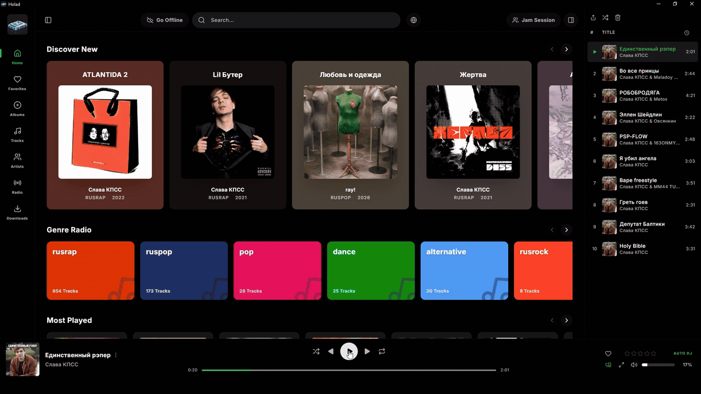

<div align="right">
  <a href="README.md"></a>
  <a href="README_en.md"></a>
</div>

<div align="center">
  <a href="https://holad-demo.onrender.com/" target="_blank" rel="noopener noreferrer" title="Try Holad Live Demo">
    
  </a>
  <a href="https://holad-demo.onrender.com/" target="_blank" rel="noopener noreferrer" title="Try Holad Live Demo">
    
  </a>
  <a href="https://holad-demo.onrender.com/" target="_blank" rel="noopener noreferrer" title="Try Holad Live Demo">
    
  </a>
  
  # Holad
  
  **Your Next-Generation Audio Experience.** 
  A modern, highly customizable streaming platform and player. Holad acts as an elegant and lightning-fast client for your Subsonic/Navidrome servers.
  While building this project, I was heavily inspired by **Spotify**, **Feishin**, and **Substreamer**. A massive thank you to their developers for their hard work and ideas!

  <br />

  <a href="https://holad-demo.onrender.com/" target="_blank" rel="noopener noreferrer">
    
  </a>

  <p><i>Click any logo above or the Live Demo button to open an interactive demonstration in your browser without installation.</i></p>

  [](https://github.com/FHRha/Holad/releases)
  [](LICENSE)
  [](https://github.com/FHRha/Holad/releases)

  <br />
  
  <h3>Download Holad</h3>

  <a href="https://github.com/FHRha/Holad/releases/latest">
    
  </a>
  <a href="https://github.com/FHRha/Holad/releases/latest">
    
  </a>
  <a href="https://github.com/FHRha/Holad/releases/latest">
    
  </a>
  <a href="https://github.com/FHRha/Holad/releases/latest">
    
  </a>
  <a href="docs/docker_en.md">
    
  </a>

  <br />
  <p><i>* P.S. The codebase and build scripts for Apple devices (macOS and iOS) are fully ready, but since the author is a poor student without any Apple products, there's currently no way to compile and publish them </i></p>
</div>

---

## Features

- **Subsonic / Navidrome Integration**: Holad securely proxies requests to your server, encrypts credentials with AES-256-GCM, and provides instant, seamless playback.
- **Modern UI/UX & Customization**: A visually stunning interface with light/dark themes, intuitive gestures (Drag-and-Drop, Pull-to-Dismiss), and customizable app icons (Classic Cassette, Wave Dark, Wave Light).
- **Custom Playlists & Offline Mode**: Create custom playlists with dynamic 2x2 mosaic covers. Native clients (Desktop & Android) support downloading tracks and albums for full offline playback.
- **Advanced Audio Engine**: Smooth Crossfade track transitions, hardware-accelerated Audio Visualizer, backpressure buffering, volume multiplier, and track exclusions (Ignore-list).
- **HoladConnect**: Real-time synchronization of playback state across all your devices. Start listening on PC and pick up seamlessly on mobile!
- **Social Hub & Jam Sessions**: Listen along with friends in real-time. Join rooms, share tracks, and manage a collaborative playback queue.
- **Local Encrypted SQLite Database**: Automatic synchronization of settings, history, playlists, and exclusions across devices. Credentials and tokens are securely encrypted using AES-256-GCM and stored locally in `holad.sqlite`.
- **Deep OS Integration**: Rich system tray menu (Windows/Linux) with album artwork preview, native Android Media Session support (lock screen and notification shade controls), and taskbar integration.
- **Localization**: Built-in multi-language support (currently **Russian** and **English** are available).
- **Self-Hosted & Demo Mode**: Full control over your data. Deploy easily on your own Linux or Windows server, or run a turnkey public showcase using Managed Demo Mode ([interactive live demo](https://holad-demo.onrender.com/)) with an automated guest lease pool and capacity protection.

## Interface Demo



## Quick Start

### Deploying with Docker

Holad provides an official multi-arch Docker image (`ghcr.io/fhrha/holad:latest`) with support for x86_64 and ARM64 (Raspberry Pi), auto-updates via Watchtower, and online database backups.

Detailed configuration guides, environment parameters, and ready-to-use recipes (stacks with Navidrome, Caddy, Nginx):
- <a href="docs/docker_en.md"></a> [**Docker Deployment Guide (English)**](docs/docker_en.md)
- <a href="docs/docker.md"></a> [**Руководство по Docker на русском**](docs/docker.md)

---

### Bare-metal Installation without Docker (Linux)

If you prefer installing directly onto your host OS:

```bash
curl -sSL https://raw.githubusercontent.com/FHRha/Holad/main/install.sh | bash
```

The script interactively prompts for the internal port (default 3000), web base path (`BASE_PATH`, default `/Holad`, or `/` for root), and `systemd` service creation.
You can also pass arguments directly:
```bash
bash install.sh --port 4000 --base-path /Holad
```
*For manual builds, use `build_release.sh` (Linux/macOS) or `build_release.bat` (Windows).*

### Nginx Configuration

If you are using **Nginx** as a reverse proxy (recommended), add the following `location` blocks inside your server block (e.g., in `/etc/nginx/sites-available/...`) to proxy requests to the player without conflicts:

```nginx
    # --- Holad Player ---
    
    # 1. Player Interface
    location /Holad {
        proxy_pass http://127.0.0.1:4000/Holad;
        include snippets/proxy-params.conf;
    }

    # 2. Login Page
    location /login {
        proxy_pass http://127.0.0.1:4000/login;
        include snippets/proxy-params.conf;
    }

    # 3. Jam Sessions Interface
    location /jam {
        proxy_pass http://127.0.0.1:4000/jam;
        include snippets/proxy-params.conf;
    }

    # 4. WebSockets for HoladConnect and Jam Sessions
    location /socket.io/ {
        proxy_pass http://127.0.0.1:4000/socket.io/;
        include snippets/proxy-params.conf;
    }
```
*(Note: `include snippets/proxy-params.conf;` includes standard proxy headers. On Ubuntu/Debian, you can use the built-in `include proxy_params;`. If you are using your own `snippets/proxy-params.conf` file, make sure it contains the following:)*
```nginx
proxy_set_header Host $host;
proxy_set_header X-Real-IP $remote_addr;
proxy_set_header X-Forwarded-For $proxy_add_x_forwarded_for;
proxy_set_header X-Forwarded-Proto $scheme;
proxy_http_version 1.1;
proxy_set_header Upgrade $http_upgrade;
proxy_set_header Connection "upgrade";
```

After making these changes, run `sudo nginx -s reload`.

### Login Issues (NAT Loopback)
To protect against SSRF, the Holad server only allows login if the URL you enter in the browser matches the external domain exactly. However, if Holad is installed on your home network, the server's attempt to verify this domain might hang due to your router blocking "u-turn" traffic (lack of Hairpin NAT).
To fix this, tell the server to route its own domain to localhost directly:
```bash
echo "127.0.0.1 YOUR_DOMAIN" | sudo tee -a /etc/hosts
```

## Architecture

- **Frontend**: React 19, Vite, TailwindCSS, Zustand, Framer Motion, Socket.io-client, dnd-kit.
- **Backend**: Node.js, Express, Socket.io (for HoladConnect and Jam sessions), SQLite (better-sqlite3), AES-256-GCM, TypeScript.
- **Desktop**: Tauri v2 (Rust).
- **Mobile**: Capacitor 8 (Android).

## License

This project is distributed under the **Holad Non-Commercial License**. 
You are free to use, study, and modify the code for personal, non-commercial purposes. Any commercial use (selling, integrating into paid products, monetizing) is strictly prohibited without explicit permission from the creator (FHRha). See the [LICENSE](LICENSE) file for details.
